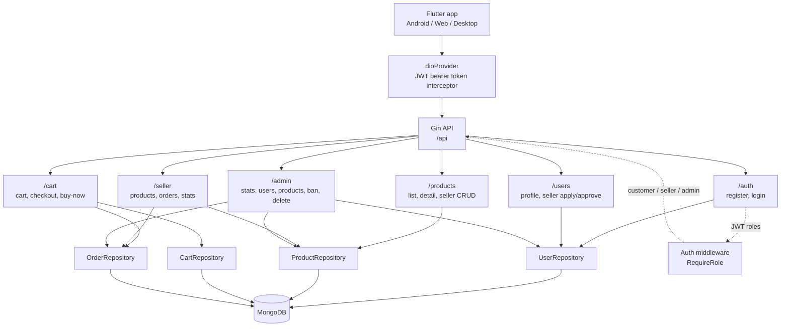

# Full-Stack E-Commerce App

This repository contains a Go/MongoDB backend and a Flutter frontend for a small Shopee-style e-commerce app.

- `backend/`: Go, Gin, MongoDB, JWT auth, bcrypt, customer cart/checkout, seller dashboard, and admin management APIs.
- `frontend/`: Flutter with a feature-first clean architecture — Riverpod (Notifier/AsyncNotifier) state management, constructor-injected Dio networking, GoRouter with centralized auth guards, secure token storage, EN/TH bilingual UI, and a Flutter web admin dashboard.
- `web_dashboard/`: Angular + Tailwind admin dashboard that uses the same backend admin APIs.

## Prerequisites

- Go 1.23 or newer
- Flutter latest stable
- Docker and Docker Compose
- Android Studio/emulator for Android testing

## Run Backend and MongoDB

From the project root:

```bash
docker compose up --build
```

The backend listens on:

```text
http://localhost:8080/api
```

Backend defaults live in `backend/.env`:

```env
MONGO_URI=mongodb://mongo:27017
MONGO_DB=ecommerce
JWT_SECRET=supersecretkey
PORT=8080
```

## Run Flutter

From `frontend/`:

```bash
flutter pub get
flutter run
```

For a specific Android emulator:

```bash
flutter run -d emulator-5554
```

Run the Flutter web admin/client on port `8082`:

```bash
flutter run -d chrome --web-port 8082
```

Run the Angular admin dashboard on port `4200`:

```bash
cd web_dashboard
npm install
npm start
```

API base URL is platform-aware in `frontend/lib/core/constants/api_constants.dart`:

- Android emulator: `http://10.0.2.2:8080/api`
- Web, desktop, iOS simulator: `http://localhost:8080/api`
- Physical device: replace the host with the computer LAN IP if needed.

### Environments (dev / staging / prod)

Each environment has a config file under `frontend/env/`:

| File | APP_ENV | Backend |
| --- | --- | --- |
| `env/dev.json` | `dev` | Platform-aware localhost candidates with dev-only failover |
| `env/staging.json` | `staging` | Fixed staging URL (edit to your real test server) |
| `env/prod.json` | `prod` | Fixed production URL |

Select the environment at build time:

```bash
flutter run  --dart-define-from-file=env/dev.json
flutter run  --dart-define-from-file=env/staging.json
flutter build apk --dart-define-from-file=env/prod.json
```

Rules enforced in code (`lib/core/config/env_config.dart`):

- Staging and prod **fail fast at startup** if `API_BASE_URL` is missing —
  a non-dev build can never silently talk to localhost.
- Non-production builds show a corner banner (`DEV` / `STAGING`) so testers
  always know which backend they are hitting.
- Providing `API_BASE_URL` disables the dev-only base URL failover.

## Seeded Test Accounts

The backend seeds these accounts on startup if they do not exist:

| Role | Email | Password | Notes |
| --- | --- | --- | --- |
| Customer | `test@example.com` | `abc12345` | Customer-only buyer account |
| Seller | `seller@example.com` | `abc12345` | Approved seller with shop data |
| Admin | `admin@example.com` | `abc12345` | Admin-only management account |

Admin users are routed to `/admin` and are blocked from customer/seller shopping routes.

## Main Flows

Customer:

1. Log in or register with name, lastname, age, gender, address, email, and password.
2. Browse products, add to cart, or use Buy Now.
3. Checkout creates seller order records and clears the cart.

Seller:

1. Log in with an approved seller account or apply through Profile.
2. Create products from Seller Dashboard.
3. Product price is limited to `1-1,000,000` THB.
4. Stock quantity is limited to `0-99`.
5. Product images are picked from gallery/camera and stored as data images for this demo.

Admin:

1. Run Flutter web on port `8082`.
2. Log in with `admin@example.com`.
3. View stats, users, products.
4. Ban/unban users.
5. Delete products.

## Frontend Architecture

The Flutter app under `frontend/lib` follows a feature-first clean architecture:

```text
lib/
  core/                     # cross-cutting infrastructure
    constants/              # platform-aware API base URLs, timeouts
    network/                # dioProvider, interceptors, secure storage provider
    router/                 # GoRouter + centralized auth/role redirect guard
    settings/               # theme + EN/TH language state
    theme/                  # Material 3 light/dark themes
    utils/                  # JWT expiry parsing
    widget/                 # shared UI (error/empty states, images, back button)
  features/<feature>/       # auth, product, cart, checkout, seller, admin, profile, home
    model/                  # immutable models with fromJson factories
    repository/             # data layer; receives Dio via constructor
    provider/               # Riverpod state (Notifier / AsyncNotifier / FutureProvider)
    screen/ | widget/       # presentational widgets only
```

Layering rules (enforced by convention and reviewed in tests):

- **Widgets never call Dio or repositories for mutations.** They call notifier
  methods (`AuthNotifier`, `CartNotifier`) or watch `FutureProvider`s.
- **Repositories are constructor-injected** with the shared `Dio` from
  `dioProvider`, so the network layer is mockable in tests
  (`overrideWithValue` a fake repository or a mocked `Dio`).
- **Auth state is a sealed hierarchy** (`AuthInitial` → `Authenticating` /
  `Authenticated` / `Unauthenticated`), making impossible states
  unrepresentable. The GoRouter redirect derives all guarding (splash, login,
  role-based admin routing) from this single source of truth.
- **401 handling is state-driven, not navigation-driven**: the Dio interceptor
  reports unauthorized responses to `AuthNotifier`, which drops the session;
  the router then redirects because it listens to auth state.
- **Cart mutations are optimistic**: `CartNotifier` applies quantity/removal
  changes locally first, replaces them with the server's authoritative cart,
  and rolls back on failure.
- **Tokens live in `flutter_secure_storage`** (Keychain / EncryptedSharedPreferences),
  never in plain SharedPreferences. Post-login deep-link redirects reject
  external URLs (open-redirect protection in `postLoginLocation`).
- **Strict static analysis**: `strict-casts`, `strict-inference`,
  `strict-raw-types`, plus lint rules on top of `flutter_lints`.

## Backend Structure



Backend code is organized around:

- `backend/cmd/main.go`: app startup, dependency wiring, routes, seeded users.
- `backend/internal/model`: Mongo/API data models.
- `backend/internal/handler`: HTTP request/response logic.
- `backend/internal/repository`: MongoDB persistence logic.
- `backend/internal/middleware`: JWT auth and role checks.
- `backend/internal/db`: MongoDB connection and indexes.

## Auth and Roles

Users store roles directly:

```json
["customer"]
["customer", "seller"]
["admin"]
```

Seller access requires both:

```text
role contains "seller"
seller_status == "approved"
```

Admin access requires:

```text
role contains "admin"
```

Banned users cannot log in or perform protected actions.

## Run Tests

Backend:

```bash
cd backend
go test ./...
```

Frontend:

```bash
cd frontend
flutter analyze
flutter test
```

Frontend test suite covers:

- **Provider/unit tests** — `AuthNotifier` login/register/bootstrap flows and
  `CartNotifier` optimistic update + rollback, via `ProviderContainer` with
  repository overrides (no network, no widgets).
- **Widget tests** — cart selection totals, register form input rules, seller
  application navigation.
- **Pure logic tests** — router redirect/open-redirect guards, model parsing
  and cart grouping/merging rules.

Docker Compose config:

```bash
docker compose config
```

## Notes

- If Android image picker or permission plugins behave strangely after dependency changes, stop Flutter and run:

```bash
flutter clean
flutter pub get
flutter run
```

- On Windows, plugin builds may require Developer Mode for symlink support:

```powershell
start ms-settings:developers
```
