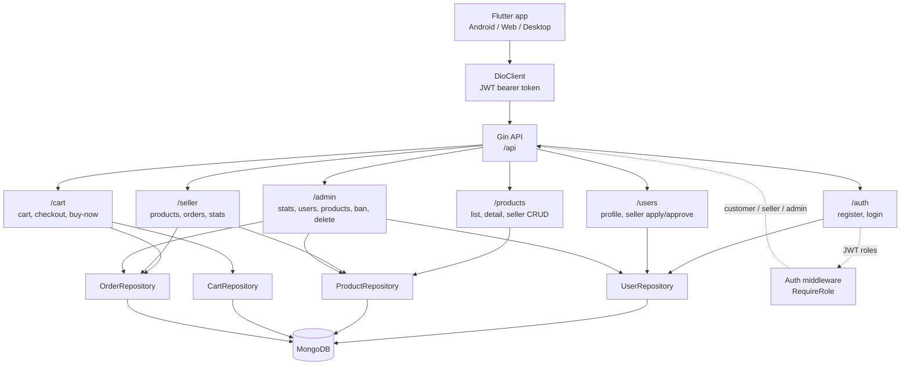

# Full-Stack E-Commerce App

This repository contains a Go/MongoDB backend and a Flutter frontend for a small Shopee-style e-commerce app.

- `backend/`: Go, Gin, MongoDB, JWT auth, bcrypt, customer cart/checkout, seller dashboard, and admin management APIs.
- `frontend/`: Flutter, Riverpod, Dio, GoRouter, secure token storage, image picking, customer/seller mobile UX, and a Flutter web admin dashboard.
- `web_dashboard/`: Angular + Tailwind admin dashboard that uses the same backend admin APIs.

## Prerequisites

- Go 1.23 or newer
- Flutter latest stable
- Docker and Docker Compose
- Android Studio/emulator for Android testing

## Run Backend and MongoDB

From the project root:

```bash
docker compose up --build
```

The backend listens on:

```text
http://localhost:8080/api
```

Backend defaults live in `backend/.env`:

```env
MONGO_URI=mongodb://mongo:27017
MONGO_DB=ecommerce
JWT_SECRET=supersecretkey
PORT=8080
```

## Run Flutter

From `frontend/`:

```bash
flutter pub get
flutter run
```

For a specific Android emulator:

```bash
flutter run -d emulator-5554
```

Run the Flutter web admin/client on port `8082`:

```bash
flutter run -d chrome --web-port 8082
```

Run the Angular admin dashboard on port `4200`:

```bash
cd web_dashboard
npm install
npm start
```

API base URL is platform-aware in `frontend/lib/core/constants/api_constants.dart`:

- Android emulator: `http://10.0.2.2:8080/api`
- Web, desktop, iOS simulator: `http://localhost:8080/api`
- Physical device: replace the host with the computer LAN IP if needed.

## Seeded Test Accounts

The backend seeds these accounts on startup if they do not exist:

| Role | Email | Password | Notes |
| --- | --- | --- | --- |
| Customer | `test@example.com` | `abc12345` | Customer-only buyer account |
| Seller | `seller@example.com` | `abc12345` | Approved seller with shop data |
| Admin | `admin@example.com` | `abc12345` | Admin-only management account |

Admin users are routed to `/admin` and are blocked from customer/seller shopping routes.

## Main Flows

Customer:

1. Log in or register with name, lastname, age, gender, address, email, and password.
2. Browse products, add to cart, or use Buy Now.
3. Checkout creates seller order records and clears the cart.

Seller:

1. Log in with an approved seller account or apply through Profile.
2. Create products from Seller Dashboard.
3. Product price is limited to `1-1,000,000` THB.
4. Stock quantity is limited to `0-99`.
5. Product images are picked from gallery/camera and stored as data images for this demo.

Admin:

1. Run Flutter web on port `8082`.
2. Log in with `admin@example.com`.
3. View stats, users, products.
4. Ban/unban users.
5. Delete products.

## Backend Structure



Backend code is organized around:

- `backend/cmd/main.go`: app startup, dependency wiring, routes, seeded users.
- `backend/internal/model`: Mongo/API data models.
- `backend/internal/handler`: HTTP request/response logic.
- `backend/internal/repository`: MongoDB persistence logic.
- `backend/internal/middleware`: JWT auth and role checks.
- `backend/internal/db`: MongoDB connection and indexes.

## Auth and Roles

Users store roles directly:

```json
["customer"]
["customer", "seller"]
["admin"]
```

Seller access requires both:

```text
role contains "seller"
seller_status == "approved"
```

Admin access requires:

```text
role contains "admin"
```

Banned users cannot log in or perform protected actions.

## Run Tests

Backend:

```bash
cd backend
go test ./...
```

Frontend:

```bash
cd frontend
flutter analyze
flutter test
```

Docker Compose config:

```bash
docker compose config
```

## Notes

- If Android image picker or permission plugins behave strangely after dependency changes, stop Flutter and run:

```bash
flutter clean
flutter pub get
flutter run
```

- On Windows, plugin builds may require Developer Mode for symlink support:

```powershell
start ms-settings:developers
```
